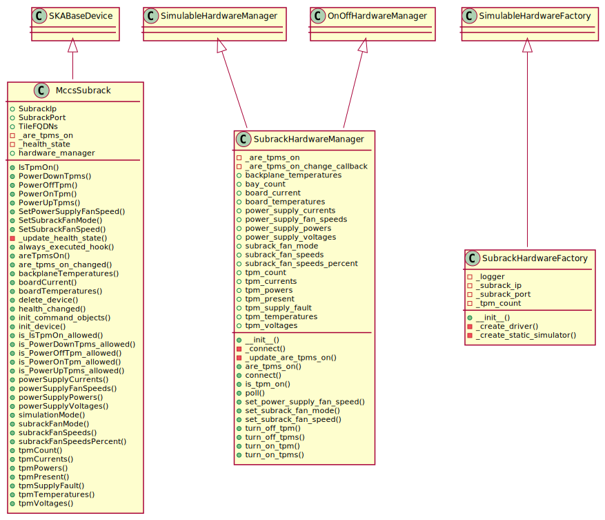

===========================================================
Subrack Device module (ska_low_mccs.subrack.subrack_device)
===========================================================

.. toctree::
   :maxdepth: 2

.. automodule:: ska_low_mccs.subrack.subrack_device
   :members:

