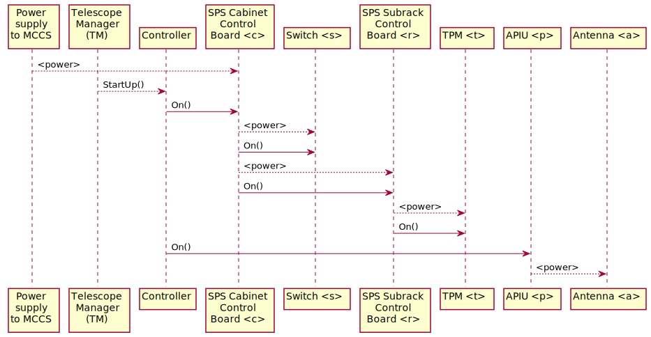
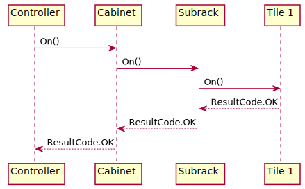
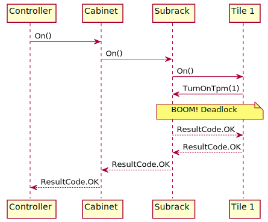
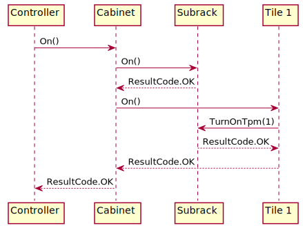

##########################
 Power management in MCCS
##########################

**********************
 Hardware power modes
**********************

SKA hardware may support up to three power modes:

-  ON: the hardware is powered on and fully operational. This mode is
   supported by all SKA hardware.

-  OFF: the hardware is powered off. Generally we would expect all
   hardware to be able to be turned off. There may be special cases,
   however, where this is not supported. For example, an externally
   managed cluster can be turned off, but the MCCS interface to it might
   only allow for submission and monitoring of jobs. Thus it cannot be
   turned off from the MCCS point of view.

-  STANDBY: the hardware is in a low-power standby mode. Such a mode is
   important in two cases:

   - where powering up a subsystem with many devices, it is important to
     limit the inrush current. This is achieved by powering up devices
     into a standby mode that uses no more than 5% of their nominal
     power; then carefully orchestrating transitions to full power.
   - where powering up a device from off could take a long time (perhaps
     several minutes). Such devices may instead be powered up into
     standby mode, in which power consumption is low, but the time to
     fully power on the hardware is short (a couple of seconds).

   Standby mode is not supported by all hardware; indeed there
   may be very few hardware devices that support it.

**********************
 Power mode breakdown
**********************

Generally speaking, one cannot tell a hardware device to turn itself
off; for once it is off, it loses the ability to turn itself on again.
Instead, power to a device is controlled by some upstream device. For
example, power to a TPM is controlled by the subrack in which that TPM
is installed. Standby mode, however, is controlled by the device itself.
Thus, implementation of the three power modes breaks down into:

- OFF: tell the upstream device (e.g. subrack) to deny power to the
  device (e.g. TPM)
- STANDBY: tell the upstream device to supply power to the device, then
  tell the device itself to go into standby mode
- ON: tell the upstream device to supply power to the device, then
  tell the device itself to go fully operational

************
 Power flow
************

Map
===
The activity diagram below shows the flow of power through the MCCS
system; i.e. cabling, essentially. The (/) points are switch points at
which the power can be turned on/off. These switch points are annotated
with the Tango device commands that drive the switch.

Note: this diagram will evolve over time.

.. image:: power_flow.svg

Startup sequence
================

Boot-up
-------

When power is first applied to MCCS, the following minimal bootup
sequence is followed:

#. Power is applied to all cabinets. All the cabinet management boards
   come on, as they are the primary control points for the cabinet
   subsystems. Switches and subelements for the SPS cabinets are
   configured to remain off, as are the subelements for all but one of
   the MCCS cabinets. 

#. Power is applied to the APIUs in the field nodes. All the antennas
   are configured to remain off.

#. The cabinet management board for the MCCS cabinet that houses the
   MCCS controller node is configured to start up the cabinet's 1Gb
   network switch and the MCCS controller node.

#. The 1Gb network switch powers up

#. The MCCS controller node boots up.

#. The kubernetes cluster is started.

#. A minimum chart is deployed, containing just the tango subsystem and
   the MCCS Controller Tango device.

Power-on
--------

When TM sends the MCCS Controller the Startup command, the MCCS
Controller must start up:

#. the rest of MCCS 
#. the SPS subrack management boards and switches
#. the SPS TPMs 
#. the field equipment

Prototype status
----------------

In the current prototype implementation, all of MCCS is deployed
immediately on startup, so that when TM sends the MCCS Controller the
Startup command, it need only start up the SPS cabinets and field
equipment.

Implementation model
====================
Currently, the operational state machine does not support transient
states; that is, there is no POWERING or STARTING state. Commands like
`Off()`, `On()` and `Startup()` are therefore implemented synchronously, and
have to complete within three seconds.

The simplest implementation would be hierarchical one, where each device
responds to a command such as `On()`, by actioning it on its own
hardware, and then actioning it on its own subservient devices. Once all
subservient devices have completed, the device itself completes. the
following diagram shows such a hierarchy for Controller, Cabinet,
Subrack and Tile devices:

Unfortunately, such an approach leads to deadlock (in the default TANGO
serialisation model), because in turning itself on, a Tile device must
command its Subrack to turn on power to the Tile's TPM. Thus
`Subrack.On()` would call `Tile.On()`, which will call
`Subrack.TurnOnTpm(N)`; and because TANGO devices will only run one
command at a time (in the default TANGO serialisation model), the call
to `Subrack.TurnOnTpm()` will be queued until `Subrack.On()` has
completed. Hence, deadlock:

To resolve this, the implementation provides for sequencing of commands.
A hierarchical model is still present, but rather that a device passing
commands to all subservient devices simultaneously, it can group its
subservient devices into pools, and invoke commands on each pool in
sequence.

The implementation of these pools and their sequencing is in the
:doc:`Pool module </api/pool>`.

In the example below, the deadlock is resolved by allowing the Cabinet
to split its subservient devices into a pool of subracks and a pool of
tiles, so that it can turn on subracks before tiles:

***************************
TANGO device initialisation
***************************
TANGO devices comprise the control system for the telescope. The control
system's state and status is affected by the state and status of the
telescope, but not vice versa. Thus, shutting down the telescope affects
control system state, but shutting down the control system does not
affect the telescope. (This is analogous to removing the batteries from
a TV remote: the TV continues to run, it is only our ability to control
the TV that has been lost.)

Also, we should not assume that TANGO Devices initialise only at
telescope startup. The control system runs on compute resources that can
fail or require maintenance. Thus the control system, or any given TANGO
device, could initialise at any time; for example, when the telescope is
in the middle of a scan.

Therefore, when a TANGO device initialises, it does not attempt to drive
the telescope into a default state; rather, it observes the telescope,
and updates its own state accordingly. (This is analogous to restoring a
TV remote's batteries: we do not expect the remote to turn the TV off so
that it can initialise into a target "TV is off" state. Rather, we
expect the remote to check whether the TV is off or on, and update its
state accordingly.)
