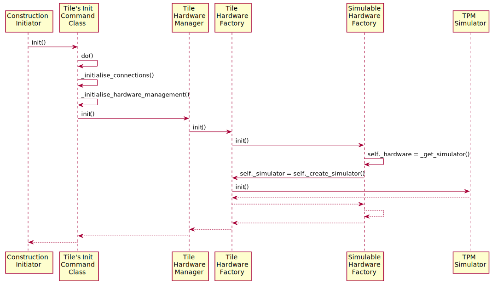

###################
 Tango Tile to TPM
###################

********************************
 Tango Tile Device Construction
********************************

The TPM (or simulator) is created during the Tile's Init command.
This command is executed automatically during construction of the Tile Tango device.
The decision whether to use the TPM simulator or a real hardware driver is made
with the simulation_mode flag. This is currently hardcoded to SimulationMode.TRUE
in tile_device.py. This means that either the TPM simulator or the real hardware
driver is available as soon as the Tile Tango device is ready for use.
You can swicth between simulation and real TPM driver by writing to the Tile device's
simulation_mode attribute. This will reset the Tile's TPM object.

The Hardware tile object is actually a factory, which returns either a Tile12 or
a Tile16 object, depending on the Tango property *TpmVersion*. 

TPM Simulator Construction
==========================

TPM Driver Construction
=======================

***************************************
 Connection to TPM & Firmware Download
***************************************

The firmware download is available via a command to the Tile Tango device.
A path and name of a Vivado bit file are passed via the Tile's
'DownloadFirmware' command to the TPM.
The code checks that the file exists and then passes this file path down
to the hardware (either real or simulated).
If no name is specified, the name defaults to "itpm_v1_6.bit" for simulator or 
Tile16 hardware driver, and to "itpm_v1_2.bit" for Tile12 hardware driver. 

Ursula's Sequence Diagram
=========================

Gianni's Code (Modified to hook into Ursula's sequence)
=======================================================

Notes
-----
* Station devices holds Vivado firmware bitfile name. But filename can be a symlink 
  with the standard name, pointing to the correct default filename, so it does not
  need to be propagated in most cases. 

* Tile devices hold specific information about the TPM's IP address

* Tile device holds information about TPM hardware version. This allows use of
  same software architecture as hardware is upgraded. 

* Programming occurs during STANDBY-> OFF transition. It can occur at any time 
  usng command  DownloadFirmware(). Call will be asynchronous as programming takes 
  several seconds. 

    - For the demo, a sleep() call is used. 

    - A more clever solution would be to cycle from STANDBY to OFF and having the 
      programming done in a separate thred. The thread will change the device state
      when the operation is completed

* TPM initialise is not currenty called. It would be called in the second option above
        The commend also takes several (up to 10) seconds to complete.  

* After this sequence has finished, the Tile WebJive pages can be queried to return
  values read from the TPM hardware

***********************
 Tile Power Management
***********************

The system is considered to be in a low power mode until the TPM firmware has been
loaded and is running. The whole topic of power management is an evolving area with conversations being
had between Gianni, Mark and Alan...It involves the subrack, network switches as well as the
TPM itself. For feature SPO-943, we will need to determine the initial state with respect to power
and power mode. These initial conditions are also being flushed out by Daniel Hayden. It's
likely the initial conditions will involve a manual setup to ensure the TPM is powered and in
a state that the Tile Tango device can communicate with it.

Proposed mapping between status and power modes are: 

* Disabled: power mode OFF

* Standby: Power mode ON, low power

* OFF: Power mode ON, 80% full power, typ.

* ON: Power 80-100%, depending on operation

This implies that the board is programmed and initialised when going from STANDBY to OFF. 
A default firmware name is coded in the device. The specific firmware name, if different, 
is provided before the STANDBY to OFF transition. Entering the STANDBY state deprograms 
the FPGAs. 

