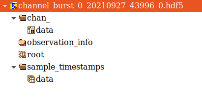
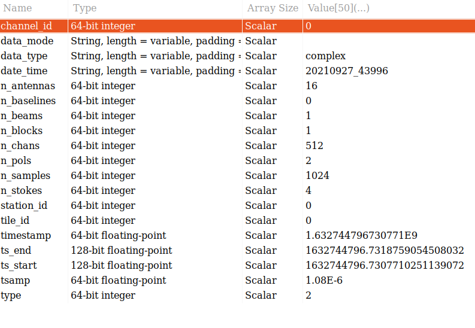
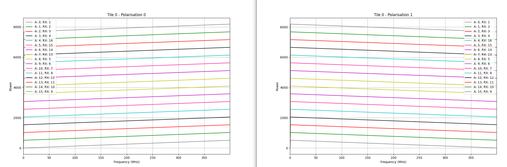

========
MCCS DAQ
========

Library Description
-------------------
The DAQ system developer for AAVS is composed of three components:

- DAQ Core library
- AAVS DAQ library
- Python interface to AAVS DAQ library

----------------
DAQ CORE LIBRARY
----------------
The DAQ core library is responsible for capturing raw frames from a network interface and forwarding them to a packet consumer. The library defines an interface to implement custom consumers, where a consumer is an entity that consumes packets of a specific type. Each consumer defines a packet filter which decides whether a given packet is of interest to the consumer or not. An instantiated consumer is attached to the packet receiver which, upon receiving a packet, passes it through the filter. If the packet is not filtered out, it is placed on a ring buffer, at which the consumer can pull and process the packet. The packet receiver can handle multiple consumers, and a ring buffer is instantiated for each receiver-consumer pair.

`Link
<https://ieeexplore.ieee.org/stamp/stamp.jsp?arnumber=8870490/>`_ to the paper describing the C++ DAQ core library. Note that the version used for this paper contains optimisations that are still not merged into the master branch (such as the multi-threaded network receiver)
The core library is compiled as a shared library.

----------------
AAVS DAQ Library
----------------
This is a separate shared library that implements AAVS-specific consumers. There are 8 consumers:

- Raw data consumer - Processes raw antenna packets (`send_raw_data`)
- Burst channel data consumer - Processes channelised data in burst mode, that is, a set number of samples for all frequency channels (`send_channelised_data`)
- Continuous channel data consumer - Processes channelised data in continuous mode, currently supports only 1 channel, which is a firmware limit (`send_channelised_data_continuous`)
- Integrated channel data consumer - Processes integrated spectra per antenna (TPM must be configured to send this data)
- Tile beam data consumer - Processes beamformed data transmitted after the tile beamformer, so all TPMs send this (`send_beam_data`)
- Integrated beam data consumer - Processes integrated tile beamformed data (TPM must be configured to send this data)
- Correlator consumer - Processes either continuous or burst channelised data, used xGPU to correlate this to generate correlation matrices
- Station beam consumer - Processes the station beam
- Integrated station beam consumer - Integrated the received station beam

All consumers have internal buffering to cater for out of order packet arrival, and most have an N-buffer system to deal with late-arriving packets belonging to previous buffers. In general, there is 1 thread performing packet reception and another thread running the consumer. The correlator has an additional thread that interacts with xGPU. The consumers are parametrizable with a JSON string. An external callback can be provided to a callback that is called when a buffer is filled. The signature of this callback is:

.. code-block:: python

   void * callback(void * data, double timestamp, unsigned arg_1, unsigned arg_2)

The first parameter is a pointer to the memory area containing the buffer. The second parameter is the timestamp of the first sample in the buffer in Unix time, provided by the TPM. `arg_1` and `arg_2` are placeholders for additional information which the consumer might want to transmit. In most cases, `arg_1` is used as a `tile_id`. For example, in the integrated station beam consumer case, `arg_1` is the number of packets received and `arg_2` the number of saturated values for a buffer. The data type and number of values pointed to by `*data` depends on the consumer, and it is assumed that the entity initialising the consumer know how to calculate these. In general, all consumers require a `nof_samples` argument that determines the size of the buffer.

------------------------
Python Interface (PyDAQ)
------------------------
The Python interface consists of three entities: the interface to the C++ code, persister library and plotting library.

The interface to the AAVS DAQ library. Note that the interface wraps the DAQ Core library, and specific consumers are instantiated and controlled by calling the appropriate calls. To instantiate a consumer, the start_consumer function the core library needs to be called, providing the exported name of the consumer and a path to the shared library containing the implementation of the consumer. Other calls behave similarly, however they are referenced by their name only. The calls available are:

- `startReceiver(interface, ip, frame_size, frames_per_block, nof_block)`. The last three are `packet_mmap` initialisation parameters.
- `loadConsumer(path_to_shared_library, consumer_name)`
- `initialiseConsumer(consumer_name, json_parameters)`
- `startConsumer(consumer_name, callback)`
- `stopConsumer(consumer_name)`
- `stopReceiver()`

The above defines the interaction between the Python code and DAQ library. Once a consumer is initialised and started, full buffers are forwarded to the Python code through the provided callbacks. For each consumer, a start, stop and callback function is provided. So for example, for raw data, the Python interface provides `start_raw_data_consumer`, `stop_raw_data_consumer` and `raw_data_consumer_callback`.

The main operations performed in each callback are:

- Interpret the C data pointer as a NumPy array of the required datatype
- Write the data to file. This is performed through an associated persister calss described below.
- If an external callback is defined, call it. An external callback is a function external to the DAQ library which is passed to the start consumer function that is called every time a new buffer is added to file.

Data received by the Python callbacks are saved to disk as HDF5 files, the implementation for which is in the `pydaq.persister` module. The module contains five persister implementations (raw, channel, beam, station and correlator). When an acquisition is started a new file is created having the following file naming convention: `type_mode_tile_timestamp_part.hdf5`, where `type` specifies the acquisition type (raw, beam, channel, station or cor), `mode` specifies the mode in which the data was transmitted (burst, integrated or continuous), `tile` specifies the tile id (logical tile number within a station), `timestamp` specifies the Unix timestamp of the first sample in the file and `part` specifies the file part number. During long acquisitions the data is split into multiple files, each of a settable size, in order to avoid corrupting the entire acquisition if an error occurs (if an HDF5 is not closed properly it might get corrupted), each file is referred to as a part of the acquisition, and the part number is included in the filename.

The entry point to PyDaq is the .py script, which contains the DaqReceiver class. This class implements the required functionality for all the modes and is configured through a dictionary. Sensible default values for all configurable items are provided, however, the values to use depend on the configuration of the tiles/station, and the parameters used to command the tiles/station to transmit the data. Examples of how to interface with this script, both as a command-line script and programmatically, are provided below. In general, the following calls are required to receiver data (in this case, raw antenna data):

.. code-block:: python
   
   # Import the DaqReceiver class and DaqModes enumeration
   from pydaq.daq_receiver_interface import DaqModes, DaqReceiver

   # Generate required configuration. Configuration items provided in this way will overwrite the defaults
   daq_config = {"directory": "/data",            # Directory where the generated HDF5 will be written (default is .)
              "nof_tiles": 16,                 # From how many tiles data will be received
              "receiver_interface": "eth3"     # The physical interface from which frames will be read
            }
   # Note that number of samples in this case is not required since this number is fixed (unless we are sending
   # synchronised raw antenna data, in which case nof_samples should be set to 4096)
 
   # Create DAQ instance
   daq_instance = DaqReceiver()
 
   # Populate configuration
   daq_instance.populate_configuration(daq_config)
 
   # Initialise library
   daq_instance.initialise_daq()
 
   # Start DAQ with channel data modes (a list of modes and callbacks can be provided)
   daq_instance.start_daq(DaqModes.RAW_DATA)
 
   # DAQ is now waiting for data. When a full buffer is received the internal raw data callback will be called, and
   # a raw data HDF5 file will be created and stored in data_directory. This script should wait for this to happen
   # (or timeout). An example of how to do so is provided in the full example below/
 
   # Data received or timed out, stop DAQ
   daq_instance.stop_daq()

In general, the generated HDF5 files contain two datasets, one with the data and the other containing a timestamp for each sample in the data. All files also contain metadata as attributes of the main dataset. This metadata includes information such as the number of antennas and channels, channel and station IDs, etc... If a station configuration file is provided to daq_receiver_interface then the metadata will also contain the station configuration (which is useful for determining the state of the station when the data was acquired). Finally, a user-provided textual description can also be included.

Example DAQ receiver commands
^^^^^^^^^^^^^^^^^^^^^^^^^^^^^
This section provides command-line examples on acquiring data from AAVS stations, including the associated command required to transmit the data. Interface eth3 is used as the receiving interface, it should be changed to the actual interface. Also here, the data is saved in the working directory.

| To receive: `daq_receiver_interface.py -i eth3 -d . -R -t 16`
| To send: `station.send_raw_data()`
| 32k samples of ADC data from each antenna/pol is received

| To receive: `daq_receiver_interface.py -i eth3 -d . -R -t 16 --raw-samples=4096`
| To send: `station.send_raw_data(sync=True)`
| 4k samples of ADC data frome ach antenna/pol is received, synchronised across all antennas

| To receive: `daq_receiver_interface.py -i eth3 -d . -C -t 16 --channel_samples=1024`
| To send: `station.send_channelised_data(1024)`
| 1024 channel voltages are received from all antennas/pol, one frequency channel at a time.

| To receive: `daq_receiver_interface.py -i eth3 -d . -X -t 16 --channel_samples=262144`
| To send: `station.send_channelised_data_continuous(204)`
| A continuous stream of channel voltages is transmitted from all antennas/pols for frequency channel 204. `channel_samples`, in this case, should be large to reduce disk write and callback overhead

| To receive: `daq_receiver_interface.py -i eth3 -d . -X -t 16 --channel_samples=262144 --continuous_period=120`
| To send: `station.send_channelised_data_continuous(204)`
| Same as above, however, the stream is not continuously saved to disk, but a buffer of size `channel_samples` is saved every `continuous_period`

| To receive: `daq_receiver_interface.py -i eth3 -d . -B -t 16`
| To send: `station.send_beam_data()`
| Each tile sends 32 samples from its partual beam (do not change `beam_samples` or `beam_channels`, they are fixed for this mode)

| To receive: `daq_receiver_interface.py -i eth3 -d . -D -t 16`
| To send: Station must be configured with `channel_integration_time != 1`
| An integrated spectrum from each antenna/pol is received every `channel_integration_time`

| To receive: `daq_receiver_interface.py -i eth3 -d . -I -t 16`
| To send: Station must be configured with `beam_integration_time != 1`
| An integrated partial beam spectrum from each tile is received every `beam_integration_time`.

| To receive: `daq_receiver_interface.py -i eth3 -d . -K -t 16 --correlator_samples=1835008`
| To send: `station.send_channelised_data(1835008)` or `station.send_channelised_data_continuous(204)`
| Run real-time correlator on the stream of incoming channelised voltages.

| To receive: `daq_receiver_interface.py -i eth3 -d . -S --beam_channels=8 --station_samples=1048576`
| To send: Station must be initialised with -B
| Received station beam stream and write to disk in integrations of `station_samples`. Note that `beam_channels` must match the equivalent number of channels in the station config file (in this case, observation bandwidth of 6.25 MHz)

| Modes can be combined:
| To receive: `daq_receiver_interface.py -i eth3 -d . -R -B -C -t 16`
| To send: `station.send_raw_data()` or `station.send_raw_data()` or `station.send_raw_data()`

PyDAQ API example
^^^^^^^^^^^^^^^^^
The code block below provides an example of how to programmatically interface with PyDAQ to acquire data from TPMs.

.. code-block:: python
   
   from pydaq.daq_receiver_interface import DaqModes, DaqReceiver
   from pydaq.persisters import ChannelFormatFileManager
   from time import sleep
 
   # Global counter for number of files processed
   files_processed = 0
 
   # Directory where to store data
   data_directory = “...”
 
   # When the receiver receives a file, it will save it to disk and then, if specified, calls
   # a user-defined callback function, providing the datatype of the saved data, the filename
   # and the tile number
   def data_callback(data_type, filename, tile):
       global files_processed
    
       # Increase number of files received
       files_processed += 1
 
   # -------------------------------- Use DaqReceiver to acquire data --------------------------------
 
   # Generate DAQ configuration
   daq_config = {"directory": data_directory,
                 "nof_channels": 1,
                 "nof_tiles": 1,
                 "nof_channel_samples": 1024,
                 "receiver_interface": "eth3"}
 
   # Create DAQ instance
   daq_instance = DaqReceiver()
 
   # Populate configuration
   daq_instance.populate_configuration(daq_config)
 
   # Initialise library
   daq_instance.initialise_daq()
 
   # Start DAQ with channel data modes (a list of modes and callbacks can be provided)
   daq_instance.start_daq(DaqModes.CHANNEL_DATA, data_callback)
 
   # Now the receiver is waiting for and receiving channelised data. Every time a file is written
   # or updated the data_callback function will be called. In this script we will just wait to receive
   # a single file, so we wait for files_processed to be 1 (this is updated in data_callback)
   while files_processed != 1:
       sleep(0.1)
 
   # Processed the number of required files, stop DAQ
   daq_instance.stop_daq()
 
   # -------------------------------- Use persisters to read the data --------------------------------
 
   # Create a burst channelised data file manager instance
   channel_file_mgr = ChannelFormatFileManager(root_path=data_directory, daq_mode=FileDAQModes.Burst)
 
   # Get file metadata. You need to specify a timestamp and tile_id. If
   # timestamp is None it will load the latest file
   metadata = channel_file_mgr.get_metadata(timestamp=None, tile_id=0)
 
   # Read a single spectrum for all pols, antennas
   data, timestamps = channel_file_mgr.read_data(timestamp=None, n_samples=1)
 
   # Data is in data, while timestamps contains a timestamp per sample
   # Convert data to a complex array (they are packed in the file)
   data = (data[‘real’] + 1j * data[‘imag’]).astype(np.complex64)
 
   # Data is a 4D numpy array in [channels, antennas, pols, samples]
   # Process data ...

-----------------
HDF5 File Formats
-----------------
The Python interface, which processes data callbacks from the C++ library, saves the disk in HDF5 format. Five different file formats are specified: Raw, Channel, Beam, Corr and Station. All these formats inherit from an abstract format, the AAVS file format, thus ensuring that they all follow the same hierarchical structure and contains roughly the same metadata. The hierarchical structure is a follows (this is for channelised data):

The first group contains the data. The groups are `chan_`, `beam_`, `raw_`, `station_` and `corr_`. The group contains one dataset called `data`, which is where the received data is stored. The organisation of the data depends on the file type. The `sample_timestamps` group contains one dataset with the timestamps of each received value (spectrum, raw data timestamps, one correlation matrix etc...). The `root` dataset contains the observation metadata stored as attributes, as in the image below. All file types contains the same metadata entries, so not all attributes are applicable to all file types (for example, beam data does not contain antennas, stokes are only applicable to correlated data, and so on). Finally, the `observation_info` dataset contains additional higher-level information, currently just a textual description which can be provided to `daq_receiver_interface.py`, and the aavs-system software version (the git commit hex number). 

A file format can be used for different SPEAD data types. For example, there are three different modes for transmitting channelised data: Burst, Continuous and Integrated. The same file format is used for the three modes, and data organization is used for all three of them. However, the data type itself is different (channelised and continuous are `complex_8t` while integrated is `uint_8t`). The `daq_mode` must therefore be specified when writing to and reading from channelised data HDF5 files.

The HDF5 file layout and data packing format is abstracted by the persisters Python library, which provides an interface for each data type. Taking channelised data HDF5 as an example, the following provides examples of how to use this library.

.. code-block:: python
   
   # Import the ChannelFormatFile Manager, which interfaces with channelised data HDF5 files
   from pydaq.persisters import ChannelFormatFileManager
 
   # Create a burst channelised data file manager instance
   channel_file_mgr = ChannelFormatFileManager(
                        root_path=data_directory,   # The directory containig the file(s) to process
                        daq_mode=FileDAQModes.Burst # The mode in which the data was acquired (Burst, Continuous or Integrated)
 
   # Get file metadata. This will return a dictionary containig the attribute of the root dataset
   metadata = channel_file_mgr.get_metadata(
        tile_id=0,          # The tile ID whose data we want to read
        timestamp=None)     # The timestamp of interest. If not timestamp is provided then the latest file in the directory will be used
 
   # Read data from a channel data file for a given query. Queries can be done based on sample indexes, r timestamps.
   data, timestamps = channel_file_mgr.read_data(
        tile_id=0,         # The tile identifier for a file batch.
        timestamp=None,    # Base timestamp for a file batch (this timestamp is part of the resolved file name that will be searched.
        n_samples=1,       # Number of samples (spectra in this case) to read
        channels=None,     # List of channels to read. None means all
        antennas=None,     # List of antennas to read. None means all
        polarizations=None,  # List of polarizations to read. None means all
        sample_offset=0,   # Offset in samples from which the read operation should start
        start_t=None,      # Start timestamp for a read query based on timestamps
        end_ts=None)       # End timestamp for a read query based on timestamp
 
   # The list of parameters which can be used depends on the file format. The above is for channelised data. For others formats:
   # Raw: no channels
   # Beam: no antennas, no tile_id, has beams
   # Station: no antennas, no tile_id
   # Corr: no antennas, has channel_id instead of tile_id (filenames use channel_id instead of tile_id)
 
   # Data is in data, while timestamps contains a timestamp per sample
   # Convert data to a complex array (they are packed in the file)
   data = (data[‘real’] + 1j * data[‘imag’]).astype(np.complex64)
 
   # Data is a 4D numpy array in [channels, antennas, pols, samples]
   # Process data ...
 
   # Note that data organisation is different for different data types:
   # Raw: [antenna, pols, samples]
   # Beam: [pols, channels, samples, beams]
   # Station: [pols, samples, channels]
   # Corr: [samples, baseline, stokes, channels]
   
--------
Plotting
--------
The final library in pydaq is the plotting library, which provides a useful script that can plot any type of data in several ways. This script is pydaq/daq_plotter.py, and can be used with a variety of options:

- Type of data to plot (-R for raw data, -C for burst channelised data, -X for continuous channel data, -B for beam data, -D for integrated channelised data, -I for integrated beam data, -S for station beam data and -K for correlated data)
- `-f FILE`, the file to plot
- `-d DIRECTORY`, data directory from which to get the file to be plotted (this is used for when there are multiple files that need to be combined or there are different acquisitions and you want to be able to use timestamps to determine which to plot. If you want to plot a specific file, use -f)
- `-t TIMESTAMP`, the timestamp to plot, as written in the filename. If not specified the latest file in the provided directory is used.
- `-p POLARISATIONS`, the list of polarisations to plot
- `-a ANTENNAS`, the list of antennas to plot
- `-c CHANNELS`, the list of channels to plot
- `-s NOF_SAMPLES`, the number of samples to plot
- `-t TILE_ID`, the tile to plot
- `--plot_type` determines the type of plots. Options are real (plot real part of complex values), image (plot imaginary part of complex values), magnitude (plot magnitude of complex values), power, waterfall (frequency vs time) and spectrum (sum across time). Not all options are available for all modes.
- `separate_plots`, which will display each antenna and pol as its own plot, depending on the plotting mode
- `-l` to display the data in logarithmic scale (20log(X))
- `-h` to display help, which includes additional command-line options

---------------
SPEAD Simulator
---------------
A SPEAD simulator is also included in the `aavs-system` repo, located in `utilities/simulators`. There is currently only one simulator, `integrated_channel_data.py`, which simulates the integrated channel data stream from TPMs. To use this script issue the following command:

`python integrated_channel_data.py --ip=*ip_to_use* -t *nof_tiles* -p *period*`

where `ip_to_use` is the IP to which the packet will be transmitted, `nof_tiles` is the number of tiles in a station to simulate, and `period` is the number of seconds to wait between each transmission (a transmission consist of the number of packets required to send all the integrated spectra from all tiles, antennas and polarisations). 

To receive the data with the DAQ python interface, issue the following command:

`python daq_receiver_interface.py -i interface -D . -t nof_tiles`

where `interface` is the network interface to use (the one whose IP is set to `ip_to_use`).

The simulator will generate a slope across frequency for all antennas. The slope is shifted by the global antenna number (tile_id * nof_antennas_per_tile + antenna) * nof_channels. The slop has a positive gradient for one polarization and a negative gradient for another. Plotting the generate file with daq_plotter for tile 0 should generate 2 plots like the ones below (command used shown below):

`python daq_plotter.py -d directory -D --plot_type=spectrum`

--------------------------------------
Setup, Configuration and Runtime Notes
--------------------------------------
To use PyDaq three modules must be installed.

The DAQ Core library:

- `git clone https://gitlab.com/ska-telescope/aavs-daq`
- `git checkout performance`
- `cd aavs-daq/src`
- `mkdir build; cd build`
- `cmake _DCMAKE_INSTALL_PREFIX=install_path`
- `[sudo] make install`

The AAVS DAQ library:

- `git clone https://gitlab.com/ska-telescope/aavs-system.git`
- `cd aavs-system/src`
- `mkdir build; cd build`
- `cmake -DCMAKE_INSTALL_PREFIX=install_path -DDAQ_DIRECTORY=daq_core_path -DWITH_CORRELATOR=[ON|OFF]`

Note that to compile with the correlator option (`-DWITH_CORRELATOR=ON`), xGPU has to be installed and configured appropriately:

- Make sure that CUDA is installed and set up correctly
- `git clone https://github.com/GPU-correlators/xGPU.git`
- `cd src`
- In `xgpu_info.h` change `NFREQUENCY` from 10 to 1, `NTIME` from 1024 to 1835008 (this can change depending on the integration time required), and `NTIME_PIPE` from 128 to 16384
- In `Makefile` change `CUDA_ARCH` to the GPU architecture being used (will generate more optimised code for the hardware)
- `[sudo] make install`

The PyDAQ library:

- Source required environment
- `cd aavs-system/python`
- `python setup.py install`

The DAQ core shared library requires root access to the network interface to read raw packets (as well as to set thread priorities, kill high priority threads etc...). Therefore, when wrapping this up with Python, the Python interpreter will need root permissions as well. Rather than having to run the interpreter in this way, special privileges, or capabilities, can be set on the Python interpreter. This is performed as follows:

`sudo setcap cap_net_raw,cap_ipc_lock,cap_sys_nice,cap_sys_admin,cap_kill+ep path_to_python_interpreter`

One instance of DaqReceiver will create a network receiver thread that binds itself with the selected interface. Multiple consumers can be instantiated and attached to this receiver instance. Multiple DaqReceiver instances can be created, and they may also be bound to the same interface. Note that every frame which is transmitted to the interface must be checked by all receiver instances, so it's more efficient to instantiate one receiver with multiple consumers rather than multiple receivers with one consumer each.

Finally, some system-level configuration is required to get the best performance (apart from first 2, not required for a single station), such as:

- Setting the interface MTU to 9000
- Increasing the interface RX buffer size
- Disabling the Ethernet flow control on the interface
- Stopping the irqbalance service
- Create the required number of huge pages on the system (used by the DAQ core ring buffer if available)
- [For multi-threaded receiver] Setting interrupt affinity to CPUs closest to the physical interface and assigning receiver thread affinity to those CPUs
- [For multi-threaded receiver and supported network interfaces] Map interface RX queues to CPU in previous steps (if `Receive Side Scaling` is enabled on the interface, packets with a different destination port will automatically be routed to different CPUs in this way)
- Set scaling governor for above CPU(s) to performance
