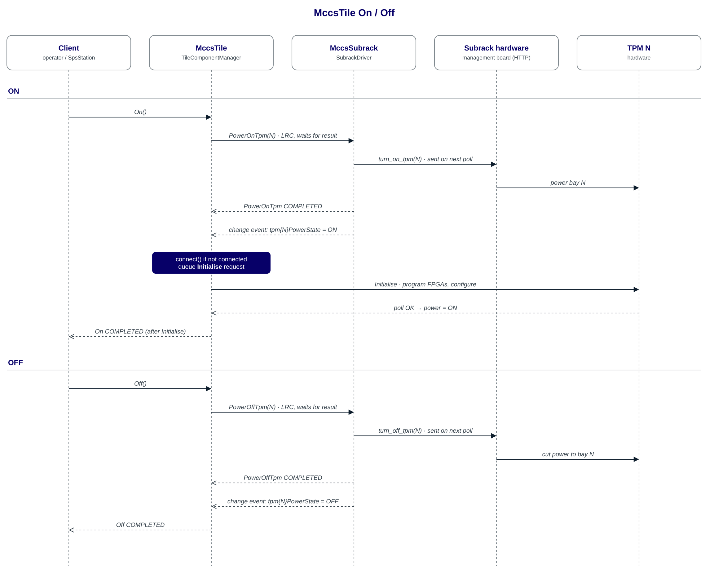
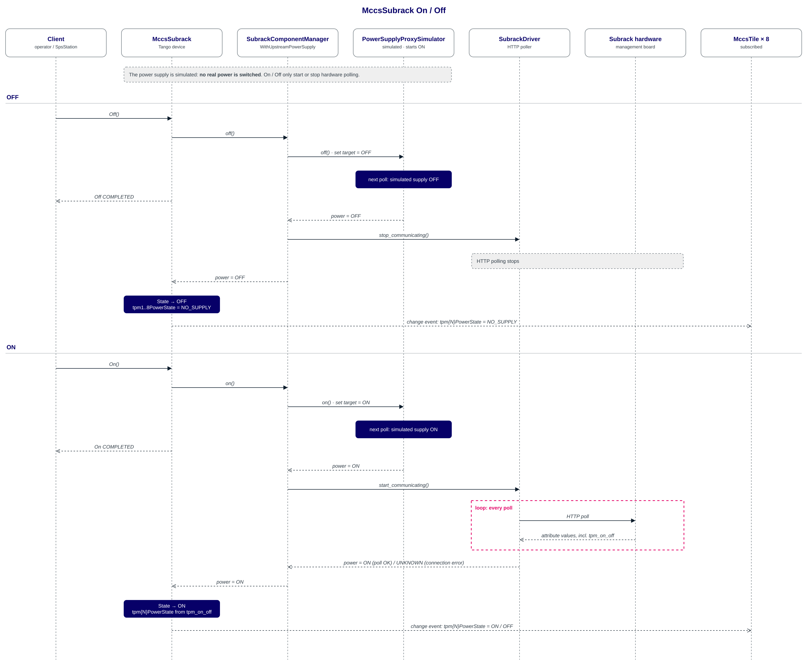
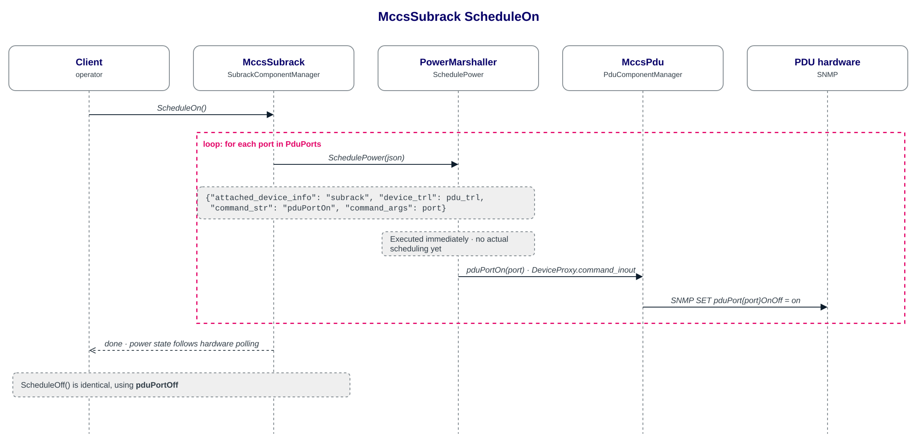
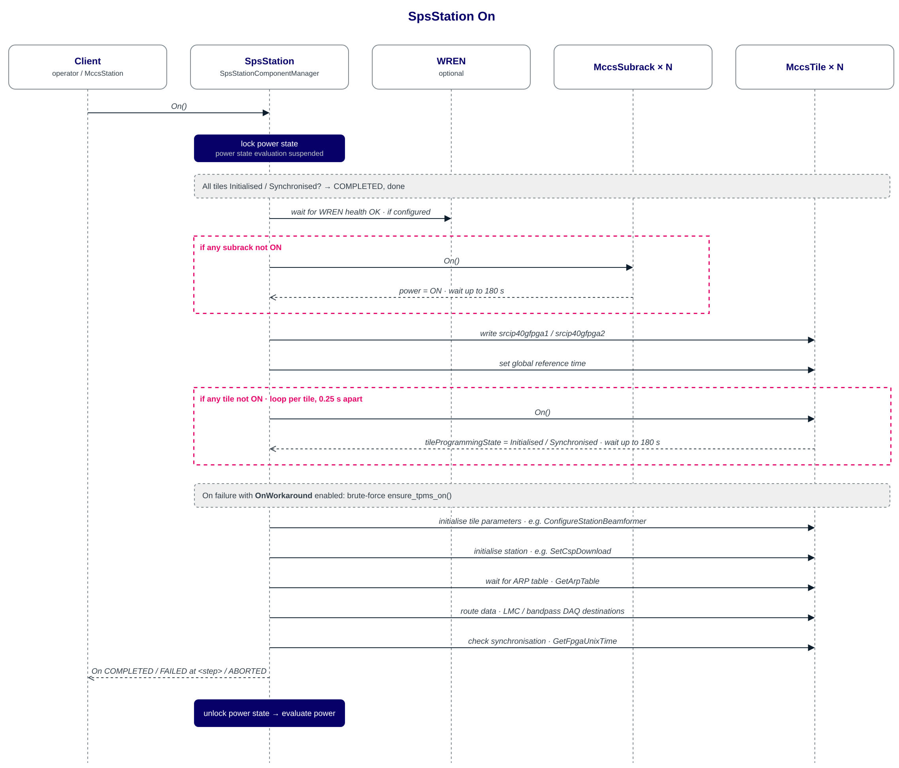
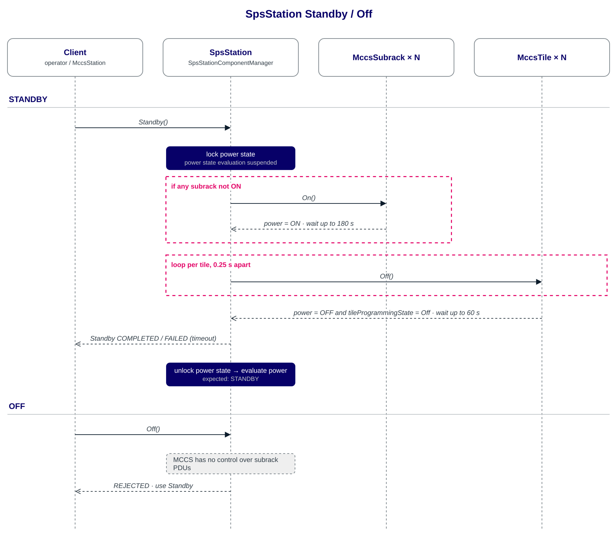

Power Distribution
==================

The Monitor, Control and Calibration System covers power management for the SKA Low Frequency Aperture Array (LFAA). This includes both operational commands such as On/Off and monitoring ability for different voltages and power use. Because of the nature of the LFAA and the hierarchical nature of MCCS devices, the power management commands can be quite a bit more complex than one might expect at first glance. 

Hardware Overview
-----------------

In order to properly cover this topic it's important to get an overview of the hardware. At the core of the LFAA we have the Radio Antenna. The signal received from it is transmitted over coaxial cables connected to a smartbox. Each smartbox supplies power to several antennas (to a maximum of 12), and it is in turn connected to a Field Node Distribution Hub (FNDH). This device provides power downstream and aggregates the signal upstream. [These set of devices are grouped together in what is called a Field Station, each containing 256 antennas, 24 smartboxes and 1 FNDH]-depends who you ask, the Field Station is a bit overloaded. In MCCS this hardware is controlled by the Power and Signal Distribution (PaSD) system.

All the data from the antennas is digitised and sent to the Tile Processing Modules (TPM). Each Tile processes the signal from 16 antennas, and an entire FieldStation has it's output covered by 16 TPMs. The Subrack supplies power to 8 TPMs, and in turn it has it's power supplied by the PDU.

To sum everything up, the LFAA components are supplied with power through FNDH (for all the antenna related hardware) and PDU + Subracks (for the signal processing).

This hardware comprises what is called a Field Node or Station. The LFAA will be comprised of 

Software Overview
-----------------

MCCS is composed of MCCS Tango Devices. These are self contained programs that control portions of the telescope. Some of these Tango Devices are directly responsible for hardware components, such as the Tile, Subrack, Smartbox, and so on. Other devices work to aggregate this devices, like the SpsStation and the FieldStation (both aggregating the devices in a Field Node for their respective system). Both of these devices are in turn controlled by the MccsStation, and all such stations are then controlled by the MccsController. At this point we should note that there are other Tango Devices in MCCS that are purely virtual. And so, we find three broad groups of Tango Devices in MCCS:

- hardware-facing devices
- aggregate devices
- virtual devices

The first set implement power commands by sending commands to hardware to turn on/off, communicating with the devices that supply power to them to confirm the current draw, and to directly report measurements from the device.

The second group implement power commands by communicating with their subdevices. They schedule on/off commands and report the power state based on the subdevice's power.

The last group often don't implement power command, and if they have a power state it is simply "On".

There is, however, a forth group: hardware devices with no direct Tango device representative. This is where the Antennas fall in. Considering that there are 131,000 Antennas planned for LFAA, having that many Tango Devices is to resource demanding when considering the benefit. As such, the antennas have their power controlled by the FieldStation Device (which represents a Field Node).

.. note::

    MCCS is a distributed system composed of microservices hosted on Kubernetees. In practice this means that the Hardware MCCS controls lives separate than the Server that hosts MCCS (at least from a power management perspective). MCCS doesn't control the power distribution to the servers hosting it. All the power commands in MCCS control power on the LFAA.

Power Mode Implementation
^^^^^^^^^^^^^^^^^^^^^^^^^

In MCCS, each Tango device's component manager tracks the power state of the component it controls, and the device reflects it in its Tango ``State`` attribute. The device also implements Tango commands to change between those states. Power states are defined by the ``PowerState`` enum from ``ska_control_model``, which has the following values:

- ON: The component is powered on and running in fully-operational mode.
- OFF: The component is turned off but can be commanded on.
- STANDBY: The component is powered on and running in low-power standby mode.
- UNKNOWN: The power mode is not known.
- NO_SUPPLY: The component is unsupplied with power and cannot be commanded on.

For example, the power mode of a TPM will be ``NO_SUPPLY`` if the subrack that powers the TPM is turned off: not only is the TPM off, but it cannot even be turned on (until the subrack has been turned on).

Every device starts with its power state ``UNKNOWN``. While the device is offline (``adminMode`` ``OFFLINE``) its Tango ``State`` is ``DISABLE``. When it is put online (``adminMode`` ``ONLINE`` or ``ENGINEERING``), its component manager starts communicating with the hardware or subdevices it controls. The power state stays ``UNKNOWN`` until communication is established. After that, the component manager reports the power state whenever it changes, and the device updates its ``State`` to match.

To change the power state, each device has a command named after the state it drives the device to: ``On()``, ``Off()`` and ``Standby()``. For example, ``device.On()`` asks the device to go to ``PowerState.ON``. These are long-running commands: the call returns straight away with a command ID, and the result is reported when the command finishes. Not every device implements all three (see the device sections below).

The ``On``/``Off``/``Standby`` commands do different things depending on the hardware or subdevices they control.

SPS Devices
-----------

All of the Tango Devices in SPSHW have a Power State and a set of commands to turn the device on or off. How the device determines its power state depending on it's role, and the commands are also higly dependent on the device. This section will cover each device and their peculiarities.

MccsTile
^^^^^^^^

The **Power state:** of a tile is influenced by the subrack that the tile is connected too. The tile polls the hardware for information periodically and as part of this process, if the poll succeeds, it sets the PowerState to ON.If a poll fails, it goes back to the value from the subrack, a mismatch between the two (TPM reachable but subrack says not ``ON``, or subrack says ``ON`` but TPM unreachable) is marked by the fault flag.

The power commands of tile are implemented as follows:

- ``On``: calls ``PowerOnTpm(N)`` on the subrack, then queues an ``Initialise`` request. The command only completes once initialisation finishes. When the subrack reports the TPM as ``ON`` and the TPM is not yet initialised, the tile starts initialising it without being asked.
- ``Off``: calls ``PowerOffTpm(N)`` on the subrack.

MccsSubrack
^^^^^^^^^^^

.. note::

  The Subrack Tango Device and the Subrack API are both under redesign and while this is meant only to improve maintainability and efficiency, some of this information might change in the future.

The **Power state:** of the subrack is set by polling the subrack management board over HTTP. A successful poll means ``ON``. A connection error means ``UNKNOWN``. The subrack also publishes a ``tpm{N}PowerState`` value for each bay: ``ON``/``OFF`` from the board's ``tpm_on_off`` reading, or ``NO_SUPPLY`` for every bay when the subrack is ``OFF``.

The power commands of subrack are implemented as follows:

- ``On``/``Off``: go through ``ComponentManagerWithUpstreamPowerSupply``, but the upstream supply is a ``PowerSupplyProxySimulator`` (starts ``ON``), so these commands don't switch any real power. ``Off`` just stops hardware polling and makes the device report ``OFF``, which the subrack's TPMs then see as ``NO_SUPPLY``. ``On`` starts polling again.

MccsPdu
^^^^^^^

The role of the PDU device is to supply the subracks with power. To do this, it inherits functionality from the SNMP Component Manager: https://developer.skao.int/projects/ska-ser-snmp/en/latest/?badge=latest, and adds a connection to the Power Marshaller. 

Individual outlets are switched with ``pduPortOn(port)``/ ``pduPortOff(port)``, which write the ``pduPort{N}OnOff`` SNMP attribute. 

The **Power State** is ``ON`` whenever an hardware poll succeeds, ``UNKNOWN`` when a poll fails. It is effectively a measure of whether communication is working.

- ``On``/``Off``/``Standby``: not implemented and will raise ``NotImplementedError``

PowerMarshaller
^^^^^^^^^^^^^^^

**Power state:** a purely virtual device. It is ``ON`` as soon as communication is established.

- ``On``/``Off``/``Standby``: not implemented.
- ``SchedulePower(json)`` takes a device TRL, a command name and an argument and runs that command on the target device (for example ``pduPortOn`` on a PDU). At the moment it runs the command straight away; nothing is actually scheduled yet.

SpsStation
^^^^^^^^^^

SpsStation is a virtual device that mostly aggregates all other tango devices in a Field Station. As such, **Power state:** is determined from the power states of its subracks and tiles:

#. Any tile ``ON`` → ``ON``
#. Any subrack ``ON`` and all tiles ``OFF``/``NO_SUPPLY`` → ``STANDBY``
#. All subracks and tiles ``NO_SUPPLY`` → ``NO_SUPPLY``
#. All subracks and tiles ``OFF``/``NO_SUPPLY`` → ``OFF``
#. Otherwise → ``UNKNOWN``

The WREN power state is logged but not used.

- ``On``: does nothing if all tiles are already initialised or synchronised. Otherwise it waits for the WREN (if one is configured), turns on the subracks, sets the tile source IPs and the global reference time, and turns on the tiles 0.25 s apart. If ``OnWorkaround`` is enabled and a step fails, it falls back to a brute-force power-on. It then initialises the tiles and the station, waits for the ARP table, routes data and checks synchronisation.
- ``Standby``: makes sure the subracks are ``ON``, then turns the tiles off 0.25 s apart and waits (up to 60 s) for every tile to report ``OFF``.
- ``Off``: always rejected. MCCS can't switch the subracks' PDUs from here, so
  ``STANDBY`` is the lowest state the station can be commanded to.

.. TODO: diagram - SpsStation power state evaluation table/flow

