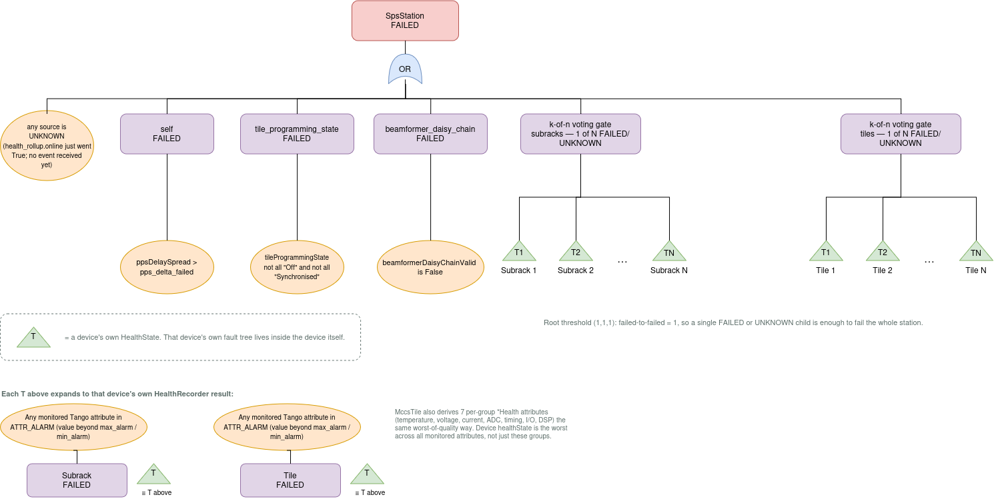
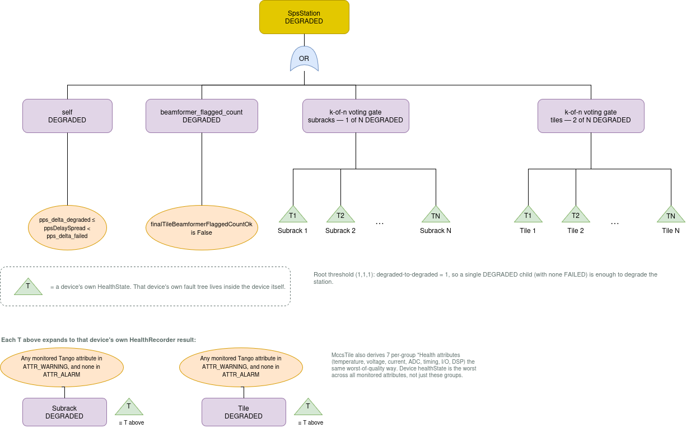
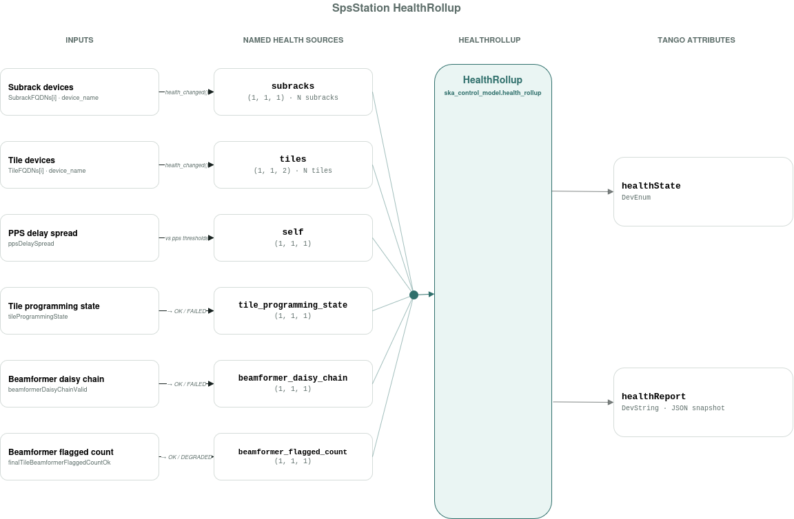

=======================
SpsStation Tango Device
=======================

The ``SpsStation`` Tango device orchestrates a number of Tango devices that make up a station's SPS hardware.

Typically, an ``SpsStation`` is responsible for 2 subracks, each containing 8 TPMs. This is the standard
configuration for a station: each TPM has 32 ADC channels, covering the X and Y polarisations of 16 antennas,
so a station with 2 subracks of 8 TPMs each has 16 TPMs and 512 ADC channels in total, i.e. a full 256-antenna
station. This is the typical configuration, but the ``SpsStation`` device can be configured to manage any number
of subracks and TPMs, which is useful for testing in hardware facilities such as the ITF or RAL.

To understand an ``SpsStation``'s ability to operate, we can use its ``healthState`` and ``healthReport``
attributes (see ``HealthState`` (https://developer.skao.int/projects/ska-control-model/en/0.3.4/health_state.html)).
The health of the SpsStation is illustrated, in simplified form, in the diagrams below:

|

Although potentially beyond the scope of this document, the following image gives some insight into how the
``HealthRollup`` class is used.

This can help you interpret the reports you can get from the SpsStation device's ``healthReport``, and how to
trace them back to the underlying inputs causing the issue.

Example ``healthReport``
-------------------------

For a station configured with 2 subracks and 4 tiles, with everything healthy, ``healthReport`` looks like:

.. code-block:: json

   {
     "self": 0,
     "tile_programming_state": 0,
     "beamformer_daisy_chain": 0,
     "beamformer_flagged_count": 0,
     "subracks": {
       "low-mccs/subrack/s8-1-1": 0,
       "low-mccs/subrack/s8-1-2": 0
     },
     "tiles": {
       "low-mccs/tile/s8-1-tpm01": 0,
       "low-mccs/tile/s8-1-tpm02": 0,
       "low-mccs/tile/s8-1-tpm03": 0,
       "low-mccs/tile/s8-1-tpm04": 0
     }
   }

Each value is a ``HealthState``: ``OK`` = 0, ``DEGRADED`` = 1, ``FAILED`` = 2, ``UNKNOWN`` = 3. There is one entry
per named rollup member; ``subracks`` and ``tiles`` are themselves dictionaries with one entry per configured
device, matching the ``k-of-n voting gate`` boxes in the diagrams above.

For example, if ``low-mccs/tile/s8-1-tpm02`` alone reported ``DEGRADED``, its entry would become ``1``, but the
overall ``healthState`` would still be ``OK``: per the ``tiles`` threshold of ``(1, 1, 2)`` shown in the diagrams
above, a single degraded tile is not enough to degrade the whole station — a second degraded tile is needed for
that.
